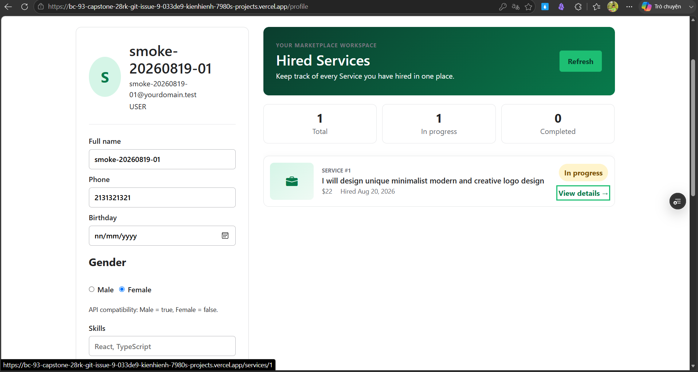
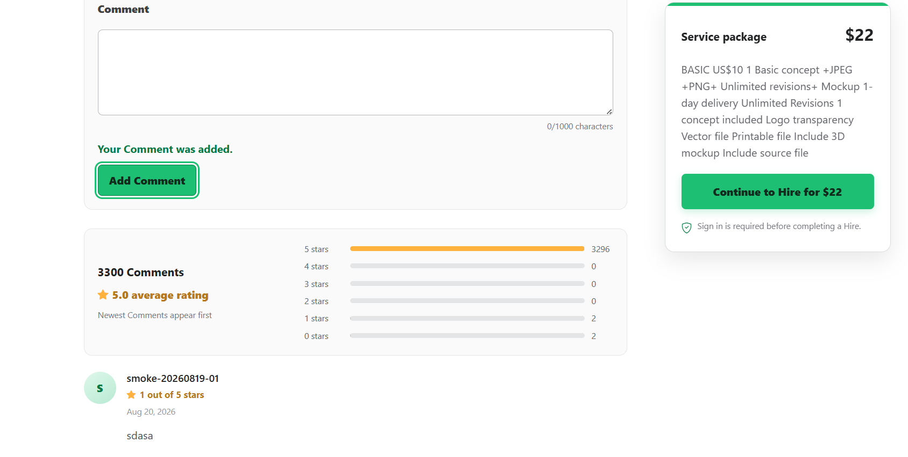
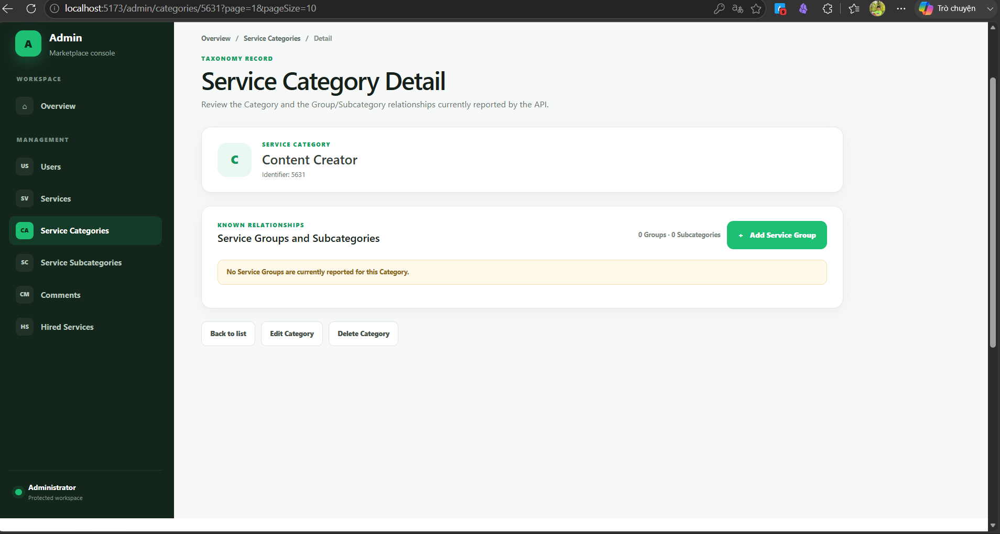

# Issue #43 manual verification evidence

Human-observed evidence for the physical-device, cross-browser, and
assistive-technology checks that automation cannot certify (see
`docs/release/release-checklist.md` §3–4 and issue #43's acceptance
criteria). Each entry below records one manual check: device/browser/AT
version, viewport, deployment URL, observer, date, and pass/fail. No
sensitive data (tokens, real user credentials) is recorded.

## Status summary (as of 2026-08-20)

Snapshot taken to close out this session; not a claim that issue #43 is
ready to close. Status against each acceptance criterion:

| # | Acceptance criterion | Status |
|---|---|---|
| 1 | Firefox + WebKit/Safari core journeys | **Partial** — Safari (physical iPhone XR) done; Firefox not done |
| 2 | Keyboard-only run (navigation, search/filters, auth, Comment, Hire/Hired Services, Profile, Admin CRUD) | **Done** — see entries below |
| 3 | NVDA + Chrome (landmarks, roles, forms/errors, announcements, route changes, drawers, tables, mutation feedback) | **Waived** — excluded from the capstone-report scope by the project owner; no screen-reader or full WCAG-conformance claim is made |
| 4 | Physical smartphone, full journey, no horizontal overflow | **Done** — iPhone XR / Safari, see below |
| 5 | Contrast, 200%/400% zoom, 320px reflow, text spacing, reduced motion, visible focus, target size | **Partial** — zoom and text spacing passed; contrast and 320px defects were resolved; reduced motion and target size remain |
| 6 | Evidence recorded with device/browser/AT/viewport/URL/observer/date/pass-fail | **Partial** — recorded for everything actually tested |
| 7 | Release-blocking defects filed and resolved | **Done** — [#98](https://github.com/kienhienh/BC93_capstone/issues/98), [#99](https://github.com/kienhienh/BC93_capstone/issues/99), [#100](https://github.com/kienhienh/BC93_capstone/issues/100), and [#101](https://github.com/kienhienh/BC93_capstone/issues/101) were fixed, merged, and closed |

**Issue #43 is not ready to close.** Remaining work: row 1's Firefox
pass; row 5's reduced-motion and target-size checks; and completing the
missing browser/device/Preview metadata noted in the evidence.

## Log

### Keyboard-only Hire journey — PASS

- **Check**: keyboard-only run covering the Hire / Hired Services journey
  (search → Service Detail → Hire → confirmation), per the "keyboard-only
  run covers ... Hire/Hired Services" acceptance criterion.
- **Browser**: Microsoft Edge (desktop)
- **Deployment URL**: `https://bc-93-capstone-28rk-git-issue-9-033de9-kienhienh-7980s-projects.vercel.app`
  — Preview deployment. *(Exact source commit/branch for this Preview
  was not confirmed at capture time; confirm against the Vercel
  deployment list before using this entry as release-blocking evidence.)*
- **Observer**: kienhienh
- **Date**: 2026-08-20
- **Result**: PASS. The full Hire flow was completed using only the
  keyboard, with no mouse interaction. The screenshot below shows the
  end state on `/profile` (Hired Services tab): the newly hired service
  ("I will design unique minimalist modern and creative logo design",
  $22, hired Aug 20 2026) listed with status "In progress", and the
  "View details" link showing keyboard focus (status bar confirms the
  link target `/services/1`, reached via Tab rather than mouse hover).

### 200%/400% zoom reflow — PASS

- **Check**: 200%/400% browser zoom reflow, per the "200%/400% zoom...
  manually checked" acceptance criterion.
- **Browser**: Microsoft Edge (desktop), InPrivate window (extensions
  disabled)
- **Pages checked**: `/profile` (authenticated), `/login`
- **Deployment URL**: `https://bc-93-capstone-28rk-git-issue-9-033de9-kienhienh-7980s-projects.vercel.app`
  — Preview deployment. *(Exact source commit/branch not confirmed at
  capture time; confirm against the Vercel deployment list before using
  this entry as release-blocking evidence.)*
- **Observer**: kienhienh
- **Date**: 2026-08-20
- **Result**: PASS, with one investigation note. At 400% zoom with
  DevTools docked to the side (which itself shrinks the usable page
  viewport, not representative of a real zoomed session), the layout
  reflowed correctly through tablet and phone breakpoints, but a script
  run in the console (`document.querySelectorAll('*')` filtered by
  `scrollWidth > document.documentElement.clientWidth`) flagged the
  header, `/login` authentication card, and footer as overflowing.
  Two follow-ups isolated the cause:
  1. With DevTools redocked to the bottom (no longer narrowing the page
     viewport) the same overflowing elements were still reported, ruling
     out the DevTools-docking width as the cause.
  2. A direct measurement immediately after —
     `document.documentElement.scrollWidth - document.documentElement.clientWidth`
     — returned **0**, i.e. no actual overflow at the moment of
     measurement. The earlier per-element list is attributed to a
     transient sub-pixel rounding artifact during/just after the zoom
     transition, not a real layout defect. Local reproduction attempts
     (Playwright at the equivalent effective widths, 320–480px) found no
     overflow on `/login` at any width.
  No release-blocking reflow defect found.

### Keyboard-only Comment journey — PASS

- **Check**: keyboard-only run covering Comment (submit a rating + text
  comment on a Service Detail page), per the "keyboard-only run
  covers ... Comment" acceptance criterion.
- **Browser**: Microsoft Edge (desktop)
- **Observer**: kienhienh
- **Date**: 2026-08-20
- **Result**: PASS. A comment ("sdasa", 1 out of 5 stars) was submitted
  using only the keyboard. The success message "Your Comment was added."
  rendered inline above the "Add Comment" button, and the button
  retained a visible focus outline after submit.

### Keyboard-only Admin navigation — PASS (partial)

- **Check**: keyboard-only run covering representative Administrator
  CRUD, per the "keyboard-only run covers ... representative
  Administrator CRUD" acceptance criterion.
- **Browser**: Microsoft Edge (desktop)
- **Observer**: kienhienh
- **Date**: 2026-08-20
- **Result**: PASS for navigation — reached Admin → Service Categories →
  category detail (`/admin/categories/5631`) entirely via keyboard, with
  "Back to list" / "Edit Category" / "Delete Category" actions visible
  and reachable.

### Keyboard-only Admin destructive-confirmation dialog — PASS

- **Check**: the delete-category confirmation dialog's keyboard safety
  (initial focus, Tab focus-trap, Escape-to-cancel), part of the
  "keyboard-only run covers ... representative Administrator CRUD"
  acceptance criterion.
- **Browser**: Microsoft Edge (desktop)
- **Observer**: kienhienh
- **Date**: 2026-08-20
- **Result**: PASS, after one false alarm caused by a stale cached
  build. The first pass against the Preview URL showed the confirmation
  text input holding initial focus (not the "Cancel" button), Tab
  escaping the dialog into the background table, and Escape not
  closing the dialog. This contradicted the source
  (`src/features/admin-category-management/components/dialogs.tsx`,
  `AccessibleDialog` + `TypedCategoryDeleteDialog`, which sets
  `initialFocusRef` to the Cancel button) and its passing automated
  coverage (`src/app/AdminCategorySafeguards.test.tsx`, 11/11 pass,
  including an explicit Tab-trap test and a keyboard-safety test at
  375/768/1440px). An independent Playwright run against a fresh local
  dev server (real Chromium, not jsdom) confirmed the current codebase
  behaves correctly: initial focus lands on Cancel, and Escape closes
  the dialog. After a hard refresh (Ctrl+Shift+R) of the Preview tab,
  the observer re-tested and confirmed both Escape-to-close and the Tab
  focus-trap now work correctly — attributing the original observation
  to a stale cached bundle in that browser tab, not a real defect. The
  "Delete Category" confirmation itself was never submitted (Cancel/Esc
  only), so no category was deleted during this check.

### Safari (physical iPhone) core journeys + no horizontal overflow — PASS

- **Check**: covers two acceptance criteria at once — "current...
  WebKit/Safari-compatible coverage" of core journeys, and "a physical
  smartphone verifies the complete representative journey and no
  unintended horizontal overflow."
- **Device/Browser**: physical iPhone XR, Safari (iOS default browser)
- **Observer**: kienhienh
- **Date**: 2026-08-20
- **Journey covered**: Home → browse/search Services → Service Detail →
  Comment → Hire → Hired Services → Profile.
- **Result**: PASS. No layout breakage, overlapping content, or
  horizontal overflow observed on any page in the journey.

### Contrast — FAIL (defect filed)

- **Check**: contrast, per the "Contrast... manually checked"
  acceptance criterion.
- **Tool**: Chrome DevTools Lighthouse, Accessibility category
- **Browser**: Google Chrome (desktop)
- **Observer**: kienhienh
- **Date**: 2026-08-20
- **Result**: Accessibility score 97/100. The "Background and
  foreground colors do not have a sufficient contrast ratio" audit
  failed, flagging: the Home hero "Search" button (white text on
  `#1dbf73` green), the `.trusted-brands` brand-name text (`#b5b6ba` on
  `#f5f5f5`), the footer copyright line and testimonial byline
  (`#95979d` on white), and footer link sub-labels (`#b5b6ba` on
  white). Filed as [#99](https://github.com/kienhienh/BC93_capstone/issues/99)
  with estimated contrast ratios per element (all below the WCAG AA
  4.5:1 / 3:1 thresholds). **Resolved by PR #103 and merged into
  develop.**

### 320px reflow — FAIL (defect filed)

- **Check**: 320px reflow, per the "320 px reflow... manually checked"
  acceptance criterion.
- **Browser**: Chrome DevTools responsive mode, 320×568
- **Observer**: kienhienh
- **Date**: 2026-08-20
- **Result**: Two distinct real defects found:
  1. **Profile page horizontal overflow**: with a long email address, the
     whole `.profile-card` overflows the viewport — Full name/Phone/
     Birthday inputs are clipped and the email text is cut off. Root
     cause identified: `.profile-identity` (`src/features/profile/profile.css:99-105`)
     is a flex row; the wrapper `
` around name/email/role
     (`src/features/profile/view.tsx:98`) has no `min-width: 0` and the
     email `
` has no `overflow-wrap`, so the unbroken email string
     forces the flex item — and the whole card — wider than the
     viewport. Filed as [#100](https://github.com/kienhienh/BC93_capstone/issues/100).
  2. **Header double-button on phone** (`/services`, `/profile`, and any
     other non-Home/Login/Register route): both "Search services" and
     "Open menu" render together at phone width, per
     `src/components/Header.tsx:159-168` (the `!usesInitialHeader`
     fallback branch doesn't exclude `viewport === "phone"`, so it
     collides with the separate phone-only "Open menu" button). Text in
     both buttons wraps awkwardly; no page-level horizontal scrollbar
     appears (buttons wrap instead of overflowing), but it's a real,
     reproducible layout defect. Filed as [#101](https://github.com/kienhienh/BC93_capstone/issues/101).
- Both defects were resolved and merged: #100 by PR #104 and #101 by
  PR #105.

### Text spacing at mobile viewport — PASS

- **Check**: manual text-spacing override.
- **Device/viewport**: mobile viewport, 375 x 667 CSS pixels. The
  physical device or emulation tool was not provided.
- **Browser/version**: not provided.
- **Deployment URL/source commit**: not provided; supplement before
  treating the evidence-metadata criterion as complete.
- **Observer**: kienhienh
- **Date**: 2026-08-20
- **Applied spacing**: line height 1.5; letter spacing 0.12em; word
  spacing 0.16em; paragraph spacing 2em.
- **Result**: **PASS.** No visible text clipping, overlapping content,
  broken controls, or visible horizontal overflow was observed.

### NVDA + Chrome verification — WAIVED

- **Decision**: the project owner excluded NVDA verification from the
  final capstone-report scope.
- **Observer/decision owner**: kienhienh
- **Date**: 2026-08-20
- **Status**: **WAIVED / not performed.** Automated axe checks and
  keyboard-only verification remain recorded, but they do not replace
  screen-reader testing. This project therefore makes no claim of full
  screen-reader support or full WCAG conformance.
