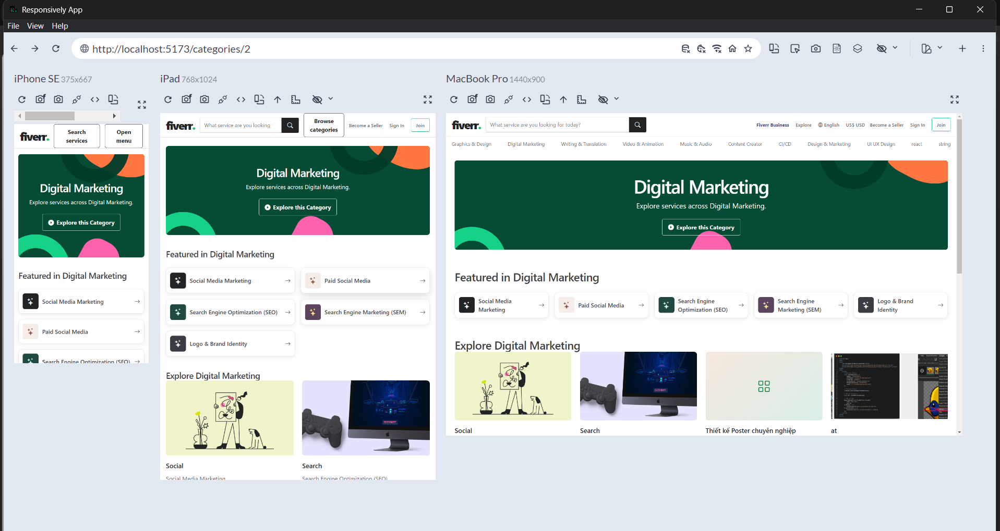
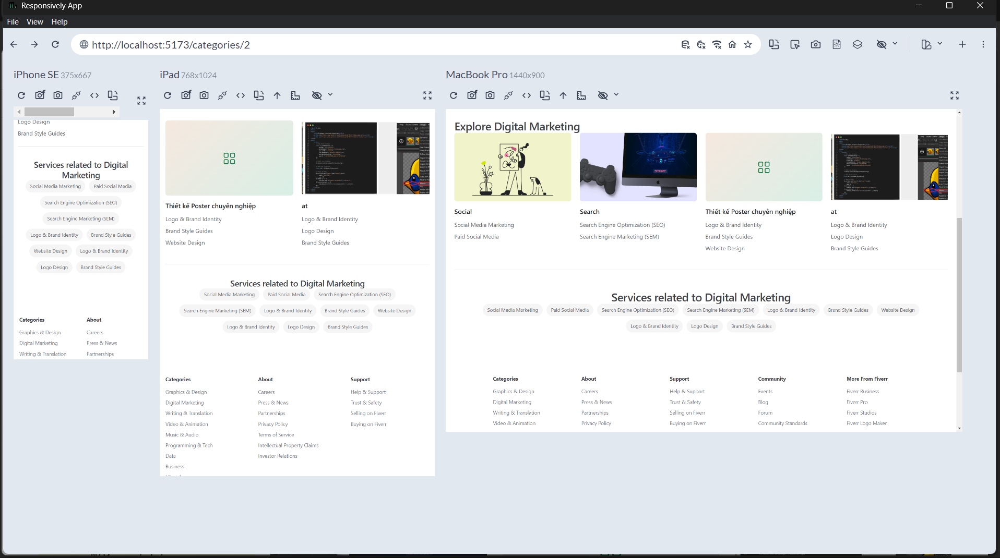

# Issue #55 visual evidence

Owner-provided Responsively App captures for the public Service Category landing page at the required viewports:

- iPhone SE: 375 × 667
- iPad: 768 × 1024
- MacBook Pro: 1440 × 900

## Top of page

## Explore, related Services, and footer

The Category uses the taxonomy-backed `Featured in …` fallback because it has no approved curated popularity configuration. Graphics & Design retains the approved `Most popular in …` presentation.
